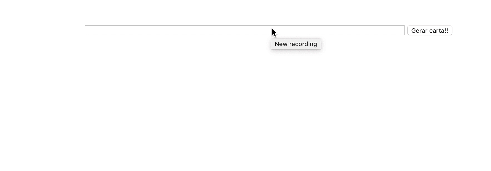

### Termos e acordos

Ao iniciar este projeto, você concorda com as diretrizes do Código de Ética e Conduta e do
Manual da Pessoa Estudante da Trybe.

# Boas vindas ao repositório do projeto Carta Misteriosa!

Você já usa o GitHub diariamente para desenvolver os exercícios, certo? Agora, para desenvolver os projetos, você deverá seguir as instruções a seguir. Fique atento a cada passo, e se tiver qualquer dúvida, nos envie por _Slack_! #vqv 🚀

Aqui você vai encontrar os detalhes de como estruturar o desenvolvimento do seu projeto a partir desse repositório, utilizando uma branch específica e um _Pull Request_ para colocar seus códigos.

---

# Sumário

- [Habilidades](#habilidades)
- [Entregáveis](#entregáveis)
  - [O que deverá ser desenvolvido](#o-que-deverá-ser-desenvolvido)
  - [Desenvolvimento](#desenvolvimento)
- [Instruções para entregar seu projeto](#instruções-para-entregar-seu-projeto)
  - [Antes de começar a desenvolver](#antes-de-começar-a-desenvolver)
  - [Durante o desenvolvimento](#durante-o-desenvolvimento)
- [Como desenvolver](#como-desenvolver)
  - [Linter](#linter)
  - [Cypress](#cypress)
- [Requisitos do projeto](#requisitos-do-projeto)

    `Requisitos obrigatórios:`
    - [1 - Deve haver um input com o id="carta-texto" onde o usuário poderá digitar o conteúdo da carta](#1---deve-haver-um-input-com-o-idcarta-texto-onde-o-usuário-poderá-digitar-o-conteúdo-da-carta)
    - [2 - Deve haver um parágrafo com o id="carta-gerada" onde o usuário verá o resultado de sua carta misteriosa](#2---deve-haver-um-parágrafo-com-o-idcarta-gerada-onde-o-usuário-verá-o-resultado-de-sua-carta-misteriosa)
    - [3 - Deve haver um botão com id="criar-carta" e ao clicar nesse botão, a carta misteriosa deve ser gerada](#3---deve-haver-um-botão-com-idcriar-carta-e-ao-clicar-nesse-botão-a-carta-misteriosa-deve-ser-gerada)
    - [4 - Ao criar uma carta através do botão com id="criar-carta", o `input` com id="carta-texto" deve permanecer com o texto digitado](#4---ao-criar-uma-carta-através-do-botão-idcriar-carta-o-input-com-idcarta-texto-deve-permanecer-com-o-texto-digitado)
    - [5 - Se o usuário não preencher o campo ou preencher com apenas espaços vazios adicionar a mensagem 'Por favor, digite o conteúdo da carta.'](#5---se-o-usuário-não-preencher-o-campo-ou-preencher-com-apenas-espaços-vazios-adicionar-a-mensagem-por-favor-digite-o-conteúdo-da-carta)
    - [6 - Crie a classe newspaper](#6---crie-a-classe-newspaper)
    - [7 - Crie a classe magazine1.](#7---crie-a-classe-magazine1)
    - [8 - Crie a classe magazine2.](#8---crie-a-classe-magazine2)
    - [9 - Crie a classe medium.](#9---crie-a-classe-medium)
    - [10 - Crie a classe big.](#10---crie-a-classe-big)
    - [11 - Crie a classe reallybig.](#11---crie-a-classe-reallybig)
    - [12 - Crie a classe rotateleft.](#12---crie-a-classe-rotateleft)
    - [13 - Crie a classe rotateright.](#13---crie-a-classe-rotateright)
    - [14 - Crie a classe skewleft.](#14---crie-a-classe-skewleft)
    - [15 - Crie a classe skewright.](#15---crie-a-classe-skewright)
    - [16 - Adicione as classes de forma aleatória a fim de estilizar as palavras.](#16---adicione-as-classes-de-forma-aleatória-a-fim-de-estilizar-as-palavras)

    `Requisitos bônus:`
    - [17 - Com uma carta misteriosa gerada, adicione a possibilidade de alterar o estilo de uma palavra específica ao clicar nela](#17---com-uma-carta-misteriosa-gerada-adicione-a-possibilidade-de-alterar-o-estilo-de-uma-palavra-específica-ao-clicar-nela)
    - [18 - Deve haver um parágrafo com o id="carta-contador" onde existirá um contador de palavras](#18---deve-haver-um-parágrafo-com-o-idcarta-contador-onde-existirá-um-contador-de-palavras)
- [Depois de terminar o desenvolvimento](#depois-de-terminar-o-desenvolvimento)
- [Revisando um pull request](#revisando-um-pull-request)
- [Avisos Finais](#avisos-finais)

# Habilidades

- Manipular o DOM.

- Manipular o Javascript.

- Manipular o CSS.

---

## Entregáveis

Para entregar o seu projeto você deverá criar um _Pull Request_ para este repositório no **GitHub**.

Este _Pull Request_ deverá conter, necessariamente, os arquivos `index.html`, `style.css` e `script.js`, que conterão seu código **_HTML_**, **_CSS_** e **_JavaScript_**, respectivamente. ⚠️ É importante que seus arquivos tenham exatamente estes nomes! ⚠️

Você pode adicionar outros arquivos se julgar necessário.

---

## O que deverá ser desenvolvido

- Será desenvolvida uma aplicação utilizando JavaScript, HTML5 e CSS3.

### Desenvolvimento

- Você irá desenvolver um site que gere cartas misteriosas.

## Instruções para entregar seu projeto:

### Antes de começar a desenvolver:

1. Clone o repositório
  * `git clone git@github.com:tryber/sd-0x-project-mistery-letter.git`.
  * Entre na pasta do repositório que você acabou de clonar:
    * `sd-0x-project-mistery-letter`

2. Instale as dependências e inicialize o projeto
  * Instale as dependências:
    * `npm install`

3. Crie uma branch a partir da branch `master`
  * Verifique que você está na branch `master`
    * Exemplo: `git branch`
  * Se não estiver, mude para a branch `master`
    * Exemplo: `git checkout master`
  * Agora crie uma branch à qual você vai submeter os `commits` do seu projeto
    * Você deve criar uma branch no seguinte formato: `nome-de-usuario-nome-do-projeto`
    * Exemplo: `git checkout -b joaozinho-project-mistery-letter`

4. Adicione as mudanças ao _stage_ do Git e faça um `commit`
  * Verifique que as mudanças ainda não estão no _stage_
    * Exemplo: `git status` (deve aparecer listada a pasta _joaozinho_ em vermelho)
  * Adicione o novo arquivo ao _stage_ do Git
      * Exemplo:
        * `git add .` (adicionando todas as mudanças - _que estavam em vermelho_ - ao stage do Git)
        * `git status` (deve aparecer listado o arquivo _joaozinho/README.md_ em verde)
  * Faça o `commit` inicial
      * Exemplo:
        * `git commit -m 'iniciando o projeto x'` (fazendo o primeiro commit)
        * `git status` (deve aparecer uma mensagem tipo _nothing to commit_ )

5. Adicione a sua branch com o novo `commit` ao repositório remoto
  * Usando o exemplo anterior: `git push -u origin joaozinho-project-mistery-letter`

6. Crie um novo `Pull Request` _(PR)_
  * Vá até a página de _Pull Requests_ do [repositório no GitHub](https://github.com/tryber/sd-0x-project-mistery-letter/pulls)
  * Clique no botão verde _"New pull request"_
  * Clique na caixa de seleção _"Compare"_ e escolha a sua branch **com atenção**
  * Clique no botão verde _"Create pull request"_
  * Adicione uma descrição para o _Pull Request_ e clique no botão verde _"Create pull request"_
  * **Não se preocupe em preencher mais nada por enquanto!**
  * Volte até a [página de _Pull Requests_ do repositório](https://github.com/tryber/sd-0x-project-mistery-letter/pulls) e confira que o seu _Pull Request_ está criado

---

## Durante o desenvolvimento

* Faça `commits` das alterações que você fizer no código regularmente

* Lembre-se de sempre após um (ou alguns) `commits` atualizar o repositório remoto

* Os comandos que você utilizará com mais frequência são:
  1. `git status` _(para verificar o que está em vermelho - fora do stage - e o que está em verde - no stage)_
  2. `git add` _(para adicionar arquivos ao stage do Git)_
  3. `git commit` _(para criar um commit com os arquivos que estão no stage do Git)_
  4. `git push` _(para enviar o commit para o repositório remoto após o passo anterior)_
  5. `git push -u nome-da-branch` _(para enviar o commit para o repositório remoto na primeira vez que fizer o `push` de uma nova branch)_

---
### Como desenvolver

## Linter

Para garantir a qualidade do código, vamos utilizar neste projeto os linters `ESLint` e `StyleLint`.
Assim o código estará alinhado com as boas práticas de desenvolvimento, sendo mais legível
e de fácil manutenção! Para rodá-los localmente no projeto, execute os comandos abaixo:

```bash
npm run lint
npm run lint:styles
```

Quando é executado o comando `npm run lint:styles`, ele irá avaliar se os seguintes arquivos com a extensão `CSS` está com o padrão correto.

Quando é executado o comando `npm run lint`, ele irá avaliar se os seguintes arquivos com a extensão `JS` e `JSX` está com o padrão correto.

⚠ **NESTE PROJETO O STYLELINT e ESLINT NÃO SERÃO AVALIADOS. VOCÊ PODE RODAR OS TESTES LOCALMENTE E FAZER AS CORREÇÕES SE DESEJAR!** ⚠

---

## Cypress

Cypress é uma ferramenta de teste de front-end desenvolvida para a web.
Você pode rodar o cypress localmente para verificar se seus requisitos estão passando, para isso execute o um dos seguintes comandos:

Para executar os testes apenas no terminal:

```bash
npm test
```

Para executar os testes e vê-los rodando em uma janela de navegador:

```bash
npm run cypress:open
```

***ou***

```bash
npx cypress open
```

Após executar um dos dois comandos acima, será aberta uma janela de navegador e então basta clicar no nome do arquivo de teste que quiser executar (project.spec.js), ou para executar todos os testes clique em Run all specs
Você também pode assistir a [este](https://vimeo.com/539240375/a116a166b9) vídeo 😉🎙

**Para rodar o cypress é preciso ter rodado o comando npm install anteriormente.**

---

## Requisitos do projeto

### 💡Veja o exemplo a seguir de como o projeto pode se parecer depois de pronto. Lembre-se que você pode ~~e deve~~ ir além para deixar o projeto com a sua cara e impressionar a todas as pessoas!



## ⚠️ Leia-os atentamente e siga à risca o que for pedido. Em particular, **atente-se para os nomes de _ids_ que alguns elementos de seu projeto devem possuir**. ⚠️

O não cumprimento de um requisito, total ou parcialmente, impactará em sua avaliação.

---

### 👀Observações importantes:

* Lembrem-se que como pessoas desenvolvedoras devemos fazer pesquisas e garimpar resultados para auxiliar no entendimento do assunto. Assim, para solucionar os requisitos do projeto é inevitável e estimulado que pesquisas sejam feitas nas mais variadas fontes (course, vídeos do course, google, youtube, etc) sempre tomando cuidado para utilizar fontes "confiáveis" nas pesquisas da Internet, como por exemplo:

  * [Javascript.com](http://javascript.com/)

  * [W3Schools](https://www.w3schools.com/js/default.asp)

  * [MDN](https://developer.mozilla.org/pt-BR/docs/Web/JavaScript)

  * [StackOverflow](https://pt.stackoverflow.com/questions/tagged/javascript)

* Os requisitos do seu projeto são avaliados automaticamente, sendo utilizada a resolução de tela de `1366 x 768` (1366 pixels de largura por 768 pixels de altura).

  * #### ⚠️ Logo, recomenda-se desenvolver seu projeto usando a mesma resolução, via instalação [deste plugin](https://chrome.google.com/webstore/detail/window-resizer/kkelicaakdanhinjdeammmilcgefonfh?hl=en) do `Chrome` para facilitar a configuração da resolução. ⚠️

* Caso for utilizar imagens nesse projeto, atente-se para o tamanho delas. **Não utilize imagens com um tamanho maior que _500Kb_.**
  * #### ⚠️ Utilize uma ferramenta [como esta](https://picresize.com/pt) para redimensionar as imagens. ⚠️

  * Caso a avaliação falhe com alguma mensagem de erro parecida com `[409:0326/130838.878602:FATAL:memory.cc(22)] Out of memory. size=4194304`, provavelmente as imagens que você está utilizando estão muito grandes. Tente redimensiona-las para um tamanho menor.

* Para verificar se a sua avaliação foi computada com sucesso, você pode verificar os **detalhes da execução do avaliador**.

  * Na página do seu _Pull Request_, acima do "botão de merge", procure por _**"Evaluator job"**_ e clique no link _**"Details"**_;

  * Na página que se abrirá, procure pela linha _**"Cypress evaluator step"**_ e clique nela;

  * Analise os resultados a partir da mensagem _**"(Run Starting)"**_;

  * Caso tenha dúvidas, consulte [este vídeo](https://vimeo.com/420861252) ou procure a monitoria.


* Você tem liberdade para adicionar novos comportamentos ao seu projeto, seja na forma de aperfeiçoamentos em requisitos propostos ou novas funcionalidades, **desde que tais comportamentos adicionais não conflitem com os requisitos propostos**.

  * Em outras palavras, você pode fazer mais do que for pedido, mas nunca menos.

* Contudo, tenha em mente que **nada além do que for pedido nos requisitos será avaliado**. _Esta é uma oportunidade de você exercitar sua criatividade e experimentar com os conhecimentos adquiridos._

---

## Requisitos do projeto

* Neste projeto, você implementará um gerador de cartas misteriosas.

**Ou seja, dado um valor digitado em um campo de texto, apresentar as palavras com uma aparência de uma carta onde cada palavra possui uma estilização própria.** 

## Requisitos Obrigatórios:

### 1 - Deve haver um `input` com o id=\"carta-texto\" onde a pessoa usuária poderá digitar o conteúdo da carta

**O que será verificado:**

- Será validado que existe um elemento `input` com `id=carta-texto`

### 2 - Deve haver um parágrafo com o id=\"carta-gerada\" onde a pessoa usuária verá o resultado de sua carta misteriosa

**O que será verificado:**

- Será validado que existe um elemento `p` com o `id="carta-gerada"`

### 3 - Deve haver um botão com id=\"criar-carta\" e ao clicar nesse botão, a carta misteriosa deve ser gerada

  Pontos importantes:

    * Cada palavra deve aparecer dentro de uma tag `span`.
    * As tags `span` devem ser adicionadas como filhas do parágrafo que possui o id `carta-gerada`.

**O que será verificado:**

- Será validado que existe um elemento `button` com `id="criar-carta"`

- Será validado que ao clicar no botão, a carta misteriosa deve ser gerada

### 4 - Ao criar uma carta através do botão com id="criar-carta", o `input` com id="carta-texto" deve permanecer com o texto digitado

**O que será verificado:**

- Será validado que ao criar uma carta através do botão `id="criar-carta"` o input` com id=\"carta-texto\" permanece com o texto digitado

### 5 - Se a pessoa usuária não preencher o campo ou preencher com apenas espaços vazios adicionar a mensagem 'Por favor, digite o conteúdo da carta.'

**O que será verificado:**

- Será validado que irá exibir a mensagem "Por favor, digite o conteúdo da carta." no elemento `p` com o `id="carta-gerada"

### 6 - Crie a classe `newspaper`

  Pontos importantes:

    * Defina as propriedades:
      - `background-color` com o valor `antiquewhite`
      - `font-family` com o valor `Times New Roman`
      - `font-weight` com o valor `bold`

**O que será verificado:**

- Será validado se a classe `newspaper` possui a propriedade `background-color` igual a rgb(250, 235, 215)

- Será validado se a classe `newspaper` possui `font-family` igual a "Times New Roman"

- Será validado se a classe `newspaper` possui a propriedade `font-weight` igual a 700

### 7 - Crie a classe `magazine1`.

  Pontos importantes:

    * Defina as propriedades:
      - `background-color` com o valor `teal`
      - `color` com o valor `white`
      - `font-family` com o valor `Verdana`
      - `font-weight` com o valor `900`
      - `text-transform` com o valor `uppercase`

**O que será verificado:**

- Será validado se a classe `magazine1` possui a propriedade `background-color` igual a rgb(0, 128, 128)`

- Será validado se a classe `magazine1` possui  a propriedade `color` igual a rgb(255, 255, 255)`

- Será validado se a classe `magazine1` possui propriedade `font-family` igual a "Verdana"

-  Será validado se a classe `magazine1` possui a propriedade `font-weight` igual a "900"

- Será validado se a classe `magazine1` possui a propriedade `text-transform` igual a "uppercase"`

### 8 - Crie a classe `magazine2`.

  Pontos importantes:

    * Defina as propriedades:
      - `background-image` com a imagem `images/pink-pattern.png`
      - `color` com o valor `fuchsia`
      - `font-family` com o valor `Verdana`
      - `font-weight` com o valor `900`

**O que será verificado:**

- Será validado se a classe `magazine2` possui a propriedade `background-image` igual a "images/pink-pattern.png"

- Será validado se a classe `magazine2` possui a propriedade `color` igual a rgb(255, 0, 255)

- Será validado se a classe `magazine2` possui a propriedade `font-family` igual a "Verdana"

- Será validado se a classe `magazine2` possui a propriedade `font-weight` igual a "900"

### 9 - Crie a classe `medium`.

  Pontos importantes:

    * Defina as propriedades:
      - `font-size` com o valor `20px`
      - `padding` com o valor `8px`

**O que será verificado:**

- Será validado se a classe `medium` possui a propriedade `font-size` igual a "20px"

- Será validado se a classe `medium` possui a propriedade `padding` igual a "8px"


### 10 - Crie a classe `big`.

  Pontos importantes:

    * Defina as propriedades:
      - `font-size` com o valor `30px`
      - `padding` com o valor `10px`

**O que será verificado:**

- Será validado se a classe `big` possui a propriedade `font-size` igual a "30px"

- Será validado se a classe `big` possui a propriedade `padding` igual a "10px"

### 11 - Crie a classe `reallybig`.

  Pontos importantes:

    * Defina as propriedades:
      - `font-size` com o valor `40px`
      - `padding` com o valor `15px`

**O que será verificado:**

- Será validado se a classe `reallybig` possui a propriedade `font-size` igual a "40px"

- Será validado se a classe `reallybig` possui a propriedade `padding` igual a "15px"

### 12 - Crie a classe `rotateleft`.

  Pontos importantes:

    * Defina as propriedades:
      - `transform` com o valor `rotate(-5deg)`

**O que será verificado:**

- Será validado se a classe `rotateleft` possui a propriedade `transform` igual a "matrix(0.996195, -0.0871557, 0.0871557, 0.996195, 0, 0)"

### 13 - Crie a classe `rotateright`.

  Pontos importantes:

    * Defina as propriedades:
      - `transform` com o valor `rotate(5deg)`

**O que será verificado:**

- Será validado se a classe `rotateright` possui a propriedade `transform` igual a "matrix(0.996195, 0.0871557, -0.0871557, 0.996195, 0, 0)"

### 14 - Crie a classe `skewleft`.

  Pontos importantes:

    * Defina as propriedades:
      - `transform` com o valor `skewX(10deg)`;

**O que será verificado:**

- Será validado se a classe `skewleft` possui a propriedade `transform` igual a "matrix(1, 0, 0.176327, 1, 0, 0)"

### 15 - Crie a classe `skewright`.

  Pontos importantes:

    * Defina as propriedades:
      - `transform` com o valor `skewX(-10deg)`;

**O que será verificado:**

- erá validado se a classe `skewright` possui a propriedade `transform` igual a "matrix(1, 0, -0.176327, 1, 0, 0)"

### 16 - Adicione as classes de forma aleatória a fim de estilizar as palavras.

  Pontos importantes:

    * As classes devem ser adicionadas às tags `span` de forma **aleatória**.
    * Sempre adicione mais de uma classe em uma palavra.
    * Utilize as classes:
      - `newspaper`, `magazine1`, `magazine2` (Grupo estilo)
      - `medium`, `big`, `reallybig` (Grupo tamanho)
      - `rotateleft`, `rotateright` (Grupo rotação)
      - `skewleft`, `skewright` (Grupo inclinação)

      Não é necessário utilizar classes de todos os grupos em uma palavra, mas **não** utilize mais de uma classe do mesmo grupo.
      Ou seja, se você utilizar as classes `magazine1` e `skewright` em uma palavra, as classes `newspaper`, `magazine2`, `skeleft` não devem ser usadas para essa mesma palavra.

**O que será verificado:**

- Será validado se ao criar uma carta ela recebe uma lista de classes aleatórias

- Será validado se ao criar uma segunda carta ela recebe uma lista de classes aleatórias

- Será validado se as classes das duas cartas não são exatamente iguais

## Requisitos Bônus:

### 17 - Com uma carta misteriosa gerada, adicione a possibilidade de alterar o estilo de uma palavra específica ao clicar nela

  Pontos importantes:

    * Ao clicar em uma palavra, um novo estilo **aleatório** deve ser aplicado.
    * O número de mudanças deve ser ilimitado;

**O que será verificado:**

- Será validado se ao clicar em uma carta uma nova lista aleatória de classes é gerada

- Será validado se ao clicar novamente na mesma carta uma nova lista aleatória de classes é gerada e se a nova lista é diferente da lista anterior

### 18 - Deve haver um parágrafo com o id=\"carta-contador\" onde existirá um contador de palavras

  Pontos importantes:

    * Esse contador deve informar a quantidade de palavras presentes na carta misteriosa gerada.
  
**O que será verificado:**

- Será validado que existe um elemento `p` com o `id="carta-contador"`

- Será validado se ao criar uma carta o elemento `p` com o `id="carta-contador"  é atualizado com o número de palavras da carta (valor numérico).

---

## Dicas

- A propriedade `transform` só funciona em elementos do tipo `block` ou `inline-block`. Então, é sugerido adicionar a propriedade `display: inline-block` para que os elementos spans apresentem o conteúdo da forma correta.

- [Que tal](https://flaviocopes.com/how-to-add-event-listener-multiple-elements-javascript/) usar um _loop_ para adicionar o mesmo evento em vários elementos? [Ou então](https://gomakethings.com/attaching-multiple-elements-to-a-single-event-listener-in-vanilla-js/) a técnica de _event bubbling_ combinada com `classList`?

- Se precisar consultar os valores do _CSS_ de um elemento a partir do _JavaScript_, [dê uma olhada aqui](https://www.w3schools.com/jsref/jsref_getcomputedstyle.asp).

- Para alterar alguma propriedade do _CSS_ de um elemento através do _JavaScript_, dê uma olhada no [atributo `style`](https://www.w3schools.com/jsref/prop_style_backgroundcolor.asp) do elemento.

- Para colocar sua página no [GitHub Pages](https://pages.github.com/), não é necessário remover o conteúdo que já está lá, você pode apenas adicionar essa nova página. Para isso, todo o conteúdo desse projeto deve ser colocado em uma pasta `/projetos/pixels-art`.

---

## Depois de terminar o desenvolvimento

Para sinalizar que o seu projeto está pronto para o _"Code Review"_ dos seus colegas, faça o seguinte:

* Vá até a página **DO SEU** _Pull Request_, adicione a label de _"code-review"_ e marque seus colegas
  * No menu à direita, clique no _link_ **"Labels"** e escolha a _label_ **code-review**
  * No menu à direita, clique no _link_ **"Assignees"** e escolha **o seu usuário**
  * No menu à direita, clique no _link_ **"Reviewers"** e digite `students`, selecione o time `tryber/students-sd-0x`

Caso tenha alguma dúvida, [aqui tem um video explicativo](https://vimeo.com/362189205).

⚠ Lembre-se que garantir que todas as _issues_ comentadas pelo **Lint** estão resolvidas! ⚠

---

### Revisando um pull request

À medida que você e as outras pessoas que estudam na Trybe forem entregando os projetos, vocês receberão um alerta via Slack para também fazer a revisão dos Pull Requests dos seus colegas. Fiquem atentos às mensagens do "Pull Reminders" no Slack!

Use o conteúdo sobre [Code Review](https://course.betrybe.com/real-life-engineer/code-review/) para te ajudar a revisar os _Pull Requests_.

# Avisos Finais

Ao finalizar e submeter o projeto, não se esqueça de avaliar sua experiência preenchendo o formulário. Leva menos de 3 minutos!

Link: [FORMULÁRIO DE AVALIAÇÃO DE PROJETO](https://be-trybe.typeform.com/to/ZTeR4IbH)

O avaliador automático não necessariamente avalia seu projeto na ordem em que os requisitos aparecem no readme. Isso acontece para deixar o processo de avaliação mais rápido. Então, não se assuste se isso acontecer, ok?

---
